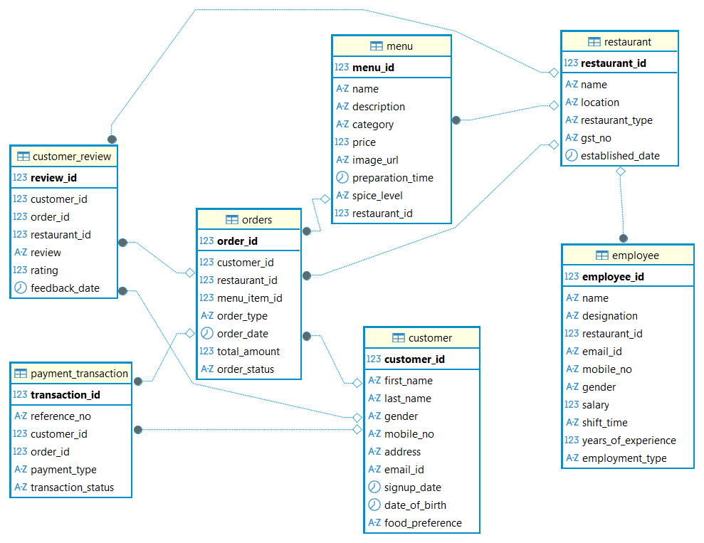

# 🍽️ Restaurant Management System (Java + JDBC + MySQL)

A simple Java console application to manage restaurant records using JDBC and MySQL. It supports basic CRUD operations with a clean multi-layered architecture.


---


## 📁 Project Structure

RestaurantProject/
├── build.bat                            
├── README.md                            
│
├── lib/
│   ├── mysql-connector-java-8.0.xx.jar  
│   └── RestaurantConstants.java         
│
├── model/
│   ├── Restaurant.java                  
│   ├── Customer.java                    
│   ├── Employee.java                    
│   ├── Menu.java                        
│   ├── Order.java                       
│   ├── PaymentTransaction.java          
│   └── CustomerReview.java              
│
├── repository/
│   └── RestaurantRepo.java              
│
├── service/
│   └── RestaurantService.java           
│
├── Main.java                            

---

## 📄 File Descriptions

- `build.bat` – Batch script to compile all Java files and run the program.
- `README.md` – Project documentation and usage guide.

### lib/
- `mysql-connector-j-9.4.0.jar` – MySQL JDBC driver for database connectivity.
- `RestaurantConstants.java` – Stores constants like DB URL, username, password, and JDBC driver class.

### model/
- `Restaurant.java` – POJO class for restaurant entity.
- `Customer.java` – POJO representing customer details.
- `Employee.java` – POJO representing employee data.
- `Menu.java` – POJO for menu items.
- `Order.java` – POJO representing customer orders.
- `PaymentTransaction.java` – POJO for payment transaction details.
- `CustomerReview.java` – POJO for customer reviews and ratings.

### repository/
- `RestaurantRepo.java` – Contains JDBC code to interact with the restaurant database (CRUD operations).

### service/
- `RestaurantService.java` – Business logic layer that calls repository functions and provides service-level operations.

### Main.java
- Entry point of the application; contains the `main()` method for running the program and testing service methods.


---


## 🗂️ Database Schema




---


## 🛠️ Setup Instructions

1. **Install MySQL** and create a `restaurant` database.
2. Add your DB credentials to `RestaurantConstants.java`.
3. Place the MySQL JDBC driver `.jar` file in the `lib/` folder.
4. Run `build.bat` to compile and execute the application.

> 💡 Make sure Java is added to your system `PATH`.


---


## ✅ Features

- Get all restaurants  
- Get restaurant by ID  
- Create a new restaurant  
- Delete restaurant by ID or by ID + Name  
- Update restaurant by ID  
- Update GST number by restaurant type  


---


## 📦 Technologies Used

- Java 8+  
- JDBC  
- MySQL  
- MySQL Connector/J (JDBC Driver)  
- `java.util.logging` for logging  


---


## 🧠 Example Usage (in `Main.java`)

```java
List<Restaurant> list = RestaurantService.getRestaurants();

Restaurant newRestaurant = new Restaurant();
newRestaurant.setName("Spice Villa");
newRestaurant.setLocation("Hyderabad");
newRestaurant.setGstNo("GST1234");
newRestaurant.setDate("2020-01-01");

RestaurantService.createRestaurant(newRestaurant);
```


---


## 🙌 Author

Developed by Rajeev Telagasetti.
Feel free to fork, use, or contribute to this project!

